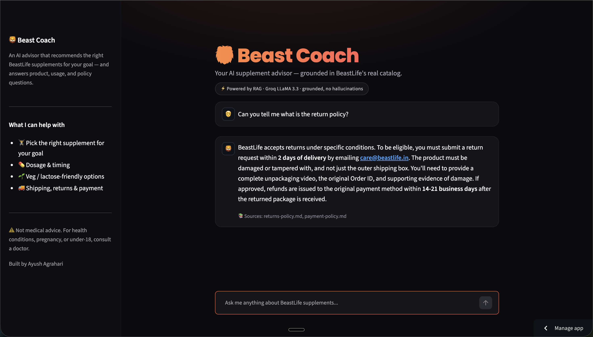

<div align="center">

# 🦁 Beast Coach

### An AI Supplement Advisor for BeastLife — grounded in their real catalog, built from scratch with RAG.

[](https://beast-coach.streamlit.app)

[](https://www.python.org/)
[](https://streamlit.io/)
[](https://www.trychroma.com/)
[](https://groq.com/)

**[🔗 Try the live demo →](https://beast-coach.streamlit.app)**

</div>

---

## 📌 Overview

**Beast Coach** is a conversational AI advisor for [BeastLife](https://beastlife.in), an Indian D2C sports-nutrition brand. Ask it your goal (*"I'm a beginner, what should I take to build muscle?"*) and it recommends the right supplements with dosage and timing — and it answers product, ingredient, and policy questions too (*"what's your return policy?"*, *"is the whey vegetarian?"*).

Crucially, it answers **only** from BeastLife's own catalog and policies. It doesn't guess, and it cites its sources — solving the two biggest problems a plain chatbot has: **outdated knowledge** and **hallucination**.

> Built as a portfolio project to demonstrate practical **Retrieval-Augmented Generation (RAG)** — implemented from scratch in Python, without LangChain, so every step is transparent and controllable.

<!-- Add a screenshot: save one to the repo as screenshot.png and it will render here -->


---

## ✨ Features

- 🎯 **Goal-based recommendations** — matches a user's goal, diet, and needs to the right BeastLife products.
- 📚 **Grounded answers with citations** — every response is built from retrieved catalog/FAQ/policy chunks, and shows its sources.
- 🛡️ **Guardrails** — an honest fallback when a question is outside the knowledge base, and a medical-safety disclaimer for health-related queries.
- 💬 **Clean chat UI** — a branded Streamlit interface with suggested prompts and source attribution.
- ⚡ **Fast inference** — powered by Groq's LLaMA 3.3.

---

## 🧠 How it works (RAG architecture)

The system has **two phases**.

### Phase A — Indexing (`build_index.py`, runs once)
The knowledge base is prepared and made searchable ahead of time:

```
Gather kb/ docs  →  Chunk (~150 words)  →  Embed each chunk  →  Store in ChromaDB
   (20 files)         (48 chunks)          (384-dim vectors)     (cosine similarity)
```

### Phase B — Answering (`beast_coach.py`, runs on every question)
```
User question
     │
     ▼
 Embed the question  ──►  turn it into a 384-dim vector
     │
     ▼
 Retrieve  ──────────►  ChromaDB returns the top-3 nearest chunks
     │
     ▼
 Guardrail check  ───►  nearest chunk too far (cosine > 0.8)? → honest fallback
     │
     ▼
 Augment  ───────────►  inject the retrieved chunks into the prompt
     │
     ▼
 Generate  ──────────►  Groq / LLaMA 3.3 writes an answer grounded in the context
     │
     ▼
 Guardrail check  ───►  health-related query? → append medical disclaimer
     │
     ▼
 Answer + sources
```

Because knowledge lives in the vector store (not the model's weights), the catalog can be updated any time by editing `kb/` and re-running the indexer — no retraining required.

---

## 🛠️ Tech Stack

| Component | Choice | Why |
|---|---|---|
| **Language** | Python | Core implementation |
| **LLM** | Groq — LLaMA 3.3 (70B) | Fast, capable, free tier |
| **Embeddings** | `sentence-transformers` (`all-MiniLM-L6-v2`) | Local, free, 384-dim, no GPU needed |
| **Vector store** | ChromaDB (cosine distance) | Stores chunks, vectors & metadata; fast similarity search |
| **UI** | Streamlit | Rapid, deployable chat interface |
| **Config** | `python-dotenv` | Keeps the API key out of source control |

---

## 📁 Project Structure

```
beast-coach/
├── kb/                    # Knowledge base — 20 BeastLife product & policy docs (.md)
├── build_index.py         # Phase A: chunk → embed → store into ChromaDB
├── beast_coach.py         # Phase B: retrieve → augment → generate → guardrails
├── app.py                 # Streamlit chat UI
├── .streamlit/
│   └── config.toml        # Theme
├── requirements.txt
└── .env                   # GROQ_API_KEY (git-ignored, never committed)
```

---

## 🚀 Run it locally

```bash
# 1. Clone and enter
git clone https://github.com/agrahariayush18/beast-coach.git
cd beast-coach

# 2. Create & activate a virtual environment
python3 -m venv venv
source venv/bin/activate          # Windows: venv\Scripts\activate

# 3. Install dependencies
pip install -r requirements.txt

# 4. Add your Groq API key (get one free at console.groq.com)
echo 'GROQ_API_KEY=your_key_here' > .env

# 5. Build the vector index (Phase A) — runs once
python build_index.py

# 6. Launch the app
streamlit run app.py
```

Then open `http://localhost:8501`.

---

## 🛡️ Guardrails

Trustworthiness is enforced in code, not just requested in the prompt:

1. **Honest fallback** — if the closest retrieved chunk exceeds a cosine-distance threshold, the app returns *"I don't have that in my knowledge base yet"* and points to `care@beastlife.in`, instead of inventing an answer.
2. **Medical safety** — if a question mentions a health condition, pregnancy, or a minor, a disclaimer is appended advising the user to consult a professional.
3. **Grounding** — the system prompt restricts the model to the retrieved context and forbids inventing products, prices, or specs.

---

## 🔮 Limitations & future work

- **Live order tracking** (BeastLife's most-requested support feature) needs access to their private order API, so it's out of scope for an external prototype — but the same agent architecture would extend to it directly with API access.
- **Knowledge base** is built from BeastLife's public catalog and policies for demo purposes.
- **Cold starts:** on the free Streamlit tier, the first request after inactivity can be slow while the app wakes and loads the embedding model.
- **Possible next steps:** WhatsApp channel, an analytics view of what customers ask most, and hybrid (keyword + semantic) retrieval.

---

## 👤 Author

**Ayush Agrahari** — B.Tech, NIT Jalandhar (2026)
[Portfolio](https://ayushagrahari-portfolio.lovable.app) · [LinkedIn](https://www.linkedin.com/in/ayushagrahari) · [GitHub](https://github.com/agrahariayush18)

---

<div align="center">

*Built to show what a small, focused AI product can do for a real business.* 🦁

</div>